# SOLAR-POWERED FLOOD ALERT SYSTEM

## Overview

The Solar-Powered Flood Alert System is an autonomous flood monitoring and early warning solution designed for deployment in flood-prone communities, riverbanks, drainage systems, and low-lying areas. The system continuously measures water level using a waterproof ultrasonic sensor and automatically determines the severity of flooding based on predefined flood classifications.

At the core of the system is an ESP32 microcontroller which processes sensor data, controls alarm devices, and manages remote communication through a SIM A7670E LTE module. When rising water levels are detected, the system activates a siren and strobe light according to the current flood warning level and sends SMS alerts to designated recipients.

The monitoring station is powered entirely by a solar energy system consisting of a solar panel, charge controller, battery pack, and power management circuitry. This allows the system to operate continuously even during power outages and adverse weather conditions commonly associated with flooding events.

Configuration and maintenance can be performed remotely through SMS commands, eliminating the need for physical access to the monitoring station. Critical settings such as flood calibration level and alert recipient numbers are stored in non-volatile memory to ensure reliable operation after power interruptions.

The primary objective of the project is to provide an affordable, reliable, and self-sustaining flood early warning system capable of delivering timely alerts that help communities prepare for and respond to flooding events before they become life-threatening.

## Materials Used

| Image                                           | Component Description                                                                                                                                                                                                                                                                             |
| ----------------------------------------------- | ------------------------------------------------------------------------------------------------------------------------------------------------------------------------------------------------------------------------------------------------------------------------------------------------- |
| 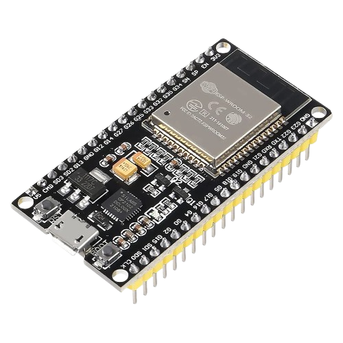                        | **ESP32 Development Board**<br><br>The main controller of the  system. It processes sensor readings, controls alarms, manages SMS communication, and stores system configuration data. Chosen for its compatibility with SIM A7670E module running at 115200 baud rate for serial communication. |
| 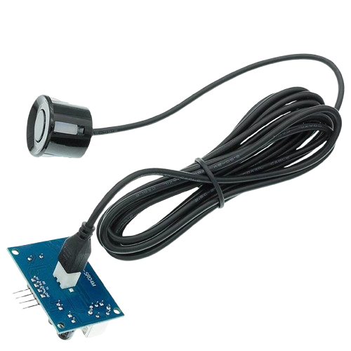 | **Waterproof Ultrasonic Sensor**<br><br>Measures the distance between the sensor and the water surface. This measurement is used to calculate flood water height. A waterproof model is required because the system operates in outdoor flood-prone environments.                                 |
|                  | **SIM A7670E LTE Module**<br><br>Provides cellular communication for sending flood alerts and receiving configuration commands through SMS using 4G/LTE standard. Enables remote monitoring without requiring internet connectivity. SIM700/SIM800 modules use 2G network which are already phased-out in most areas in the Philippines.                                                                                    |
|          | **4-Channel Relay Module**<br><br>Allows the ESP32 to safely switch the sirens and strobe lights, while maintaining electrical isolation from the controller.                                                                                      |
| 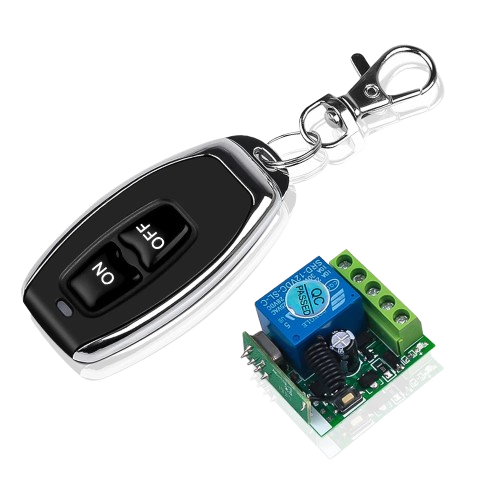                | **Remote Switch Module**<br><br>Provides remote power control and maintenance capability. Chosen for its convenience for switching as the prototype is designed to be mounted several feet above ground level and absence of physical switch for additional security for outdoor installations.                                                                                                                         |
| 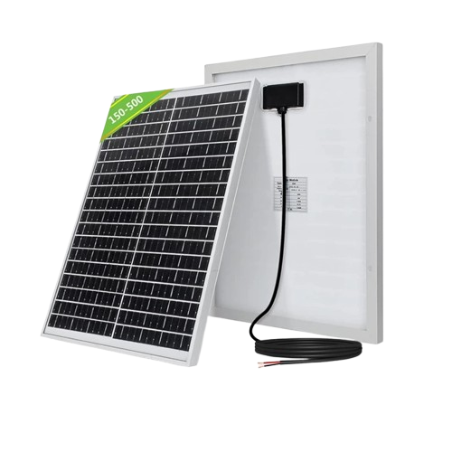                  | **Solar Panel**<br><br>Primary energy source for the system. Converts sunlight into electrical energy to keep the monitoring station operational in remote locations. This ensures 100% uptime of the monitoring system by eliminating the need to manually charge or replace the battery from time to time and dependence on utility power supply which may be interrupted during natural calamities like flooding.                                                                                                                             |
| 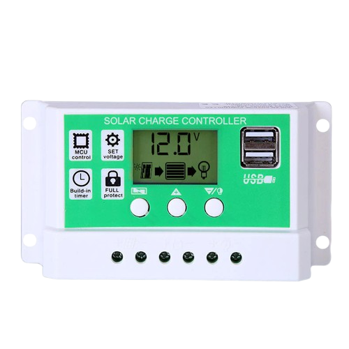      | **Solar Charge Controller**<br><br>Regulates charging current from the solar panel and protects the battery from overcharging and excessive discharge, extending battery life.                                                                                                                    |
| 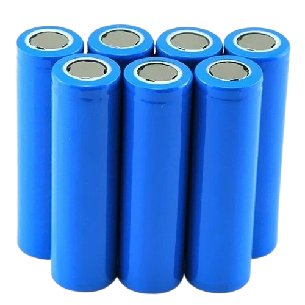           | **18650 Lithium-Ion Battery Pack**<br><br>Stores energy collected from the solar panel and powers the system during nighttime operation and periods of low sunlight.                                                                                                                              |
| 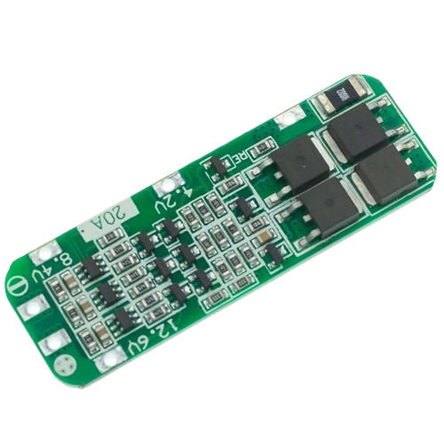    | **Battery Management System (BMS)**<br><br>Protects the battery pack from overcharge, over-discharge, over-current, and short-circuit conditions. Essential for safe battery operation.                                                                                                           |
| 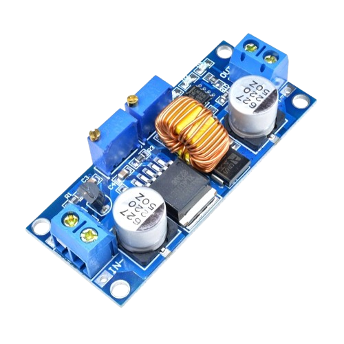                       | **XL4015 DC-DC Buck Converter**<br><br>Converts battery voltage to stable operating voltages required by the ESP32, SIM module, and other electronic components. This module can support up to 5A stable voltage for the ESP32 and SIM MODULE with minimal electrical noise and high efficiency.                                   |
| 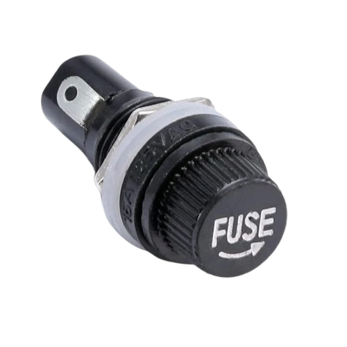                  | **Fuse Holder with Fuse**<br><br>Provides overcurrent protection for the power system. Prevents damage to electronics and wiring during fault conditions. There is a fuse between the solar charge controller and solar panel, solar charge controller and battery, and solar charge controller output and the load. Panel mount fuse holder is chosen for convenient fuse replacement without the need to manually open the waerproof enclosure.                                                                |
| 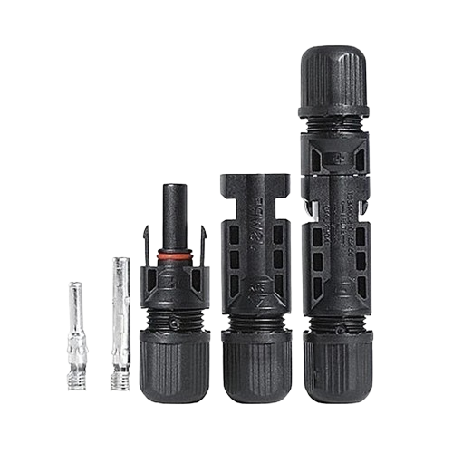                          | **MC4 Solar Connectors**<br><br>Used for reliable weather-resistant electrical connections between solar panels and the charging system. Designed specifically for outdoor solar installations.                                                                                                   |

## DISCUSSION OF THE CIRCUIT

  

The Solar-Powered Flood Alert System is designed to operate continuously in outdoor environments without dependence on utility power. The power subsystem is centered around a 50W, 18V solar panel connected to a 20A PWM solar charge controller. The solar charge controller regulates charging current from the solar panel and safely charges the battery while preventing overcharging and excessive battery discharge.

Energy storage is provided by a 3-cell (3S) lithium-ion battery pack composed of 18650 cells. A Battery Management System (BMS) is installed to protect the battery pack from overcharge, over-discharge, overcurrent, and short-circuit conditions. This ensures safe battery operation and improves overall battery lifespan.

Three fuse holders are incorporated into the system for electrical protection. The first fuse is installed between the solar panel and the solar charge controller, the second fuse is placed between the battery pack and the charge controller, and the third fuse protects the load circuit connected to the charge controller output. These fuses help prevent wiring damage and equipment failure during fault conditions.

The system controller is an ESP32 development board powered through an XL4015 DC-DC buck converter. The XL4015 converts the battery voltage into a stable 5V supply suitable for the ESP32, SIM A7670E LTE module, relay module, and sensor circuitry. The XL4015 was selected due to its high current capability, good efficiency, and stable output voltage under varying load conditions.

Flood monitoring is performed using a JSN-SR04T waterproof ultrasonic sensor mounted above the monitored water surface. The sensor continuously measures the distance between itself and the water surface. The ESP32 calculates the water level by comparing the measured distance with a stored zero-level calibration value.

Remote communication is provided by the SIM A7670E LTE module connected directly to the ESP32 through hardware serial communication. The LTE module enables SMS-based flood notifications and remote configuration commands without requiring internet connectivity. LTE communication was selected because legacy 2G networks used by older GSM modules are already unavailable or unreliable in many areas.

Local warning is provided through a 12V siren with rotating strobe light. The siren is controlled using a relay module that electrically isolates the low-voltage ESP32 control circuitry from the higher-current alarm circuit. Depending on the detected flood level, the ESP32 activates the relay according to predefined alarm patterns.

To improve maintainability and simplify future repairs, the circuit is assembled on a prototyping PCB using solid copper hookup wires instead of loose jumper wires. Pin headers are installed for major modules including the ESP32, SIM A7670E, relay module, ultrasonic sensor, and power converter. This approach provides a more reliable electrical connection while allowing individual modules to be removed and replaced easily without desoldering. The use of pin headers also reduces troubleshooting time and supports rapid component replacement during field maintenance.

Overall, the circuit combines solar power generation, battery energy storage, LTE communication, flood sensing, and alarm notification into a self-sustaining monitoring system capable of operating continuously in remote flood-prone environments.

## AT Commands Used by the System

| AT Command                | Description and Sample Response                                                                                                                                                                                                      |
| ------------------------- | ------------------------------------------------------------------------------------------------------------------------------------------------------------------------------------------------------------------------------------ |
| `AT`                      | **Communication Test**<br><br>Used during startup to verify communication between ESP32 and SIM A7670E.<br><br>**Response:**<br>`OK`                                                                                                 |
| `AT+CMGF=1`               | **SMS Text Mode**<br><br>Configures the modem to send and receive SMS messages in human-readable text format instead of PDU mode.<br><br>**Response:**<br>`OK`                                                                       |
| `AT+CEREG?`               | **LTE Network Registration Status**<br><br>Checks whether the modem is connected to the cellular network.<br><br>**Response:**<br>`+CEREG: 0,1`<br>`OK`                                                                              |
| `AT+COPS?`                | **Network Operator Identification**<br><br>Retrieves the current network provider.<br><br>**Response:**<br>`+COPS: 0,2,"51503",7`<br>`OK`                                                                                            |
| `AT+CNUM`                 | **SIM Card Phone Number**<br><br>Retrieves the phone number assigned to the installed SIM card if available.<br><br>**Response:**<br>`+CNUM: ," +639XXXXXXXXX",145`<br>`OK`                                                          |
| `AT+CMGS="+639XXXXXXXXX"` | **Send SMS Message**<br><br>Initiates SMS transmission to the specified recipient number.<br><br>**Response:**<br>`>` (SMS prompt)<br>`+CMGS: 25`<br>`OK`                                                                            |
| `AT+CMGR=<index>`         | **Read SMS Message**<br><br>Reads a specific SMS message from SIM memory using its storage index.<br><br>**Response:**<br>`+CMGR: "REC UNREAD","+639XXXXXXXXX","","26/06/19,10:18:42+32"`<br>`[SECURITY_CODE,GET_SENSOR_DATA,DATA]`<br>`OK` |
| `AT+CMGL="ALL"`           | **List All SMS Messages**<br><br>Retrieves all SMS messages stored in SIM memory for debugging and maintenance purposes.<br><br>**Response:**<br>`+CMGL: 1,"REC READ","+639XXXXXXXXX"`<br>`TEST MESSAGE`<br>`OK`                     |
| `AT+CMGD=<index>`         | **Delete SMS Message**<br><br>Deletes a specific SMS message from SIM storage.<br><br>**Response:**<br>`OK`                                                                                                                          |
| `AT+CMGD=1,4`             | **Delete All SMS Messages**<br><br>Deletes all SMS messages stored in SIM memory.<br><br>**Response:**<br>`OK`                                                                                                                       |

---
You can add this section after the **Discussion of the Circuit** section as **Physical Design and Mechanical Structure**:

---

## PHYSICAL DESIGN AND MECHANICAL STRUCTURE

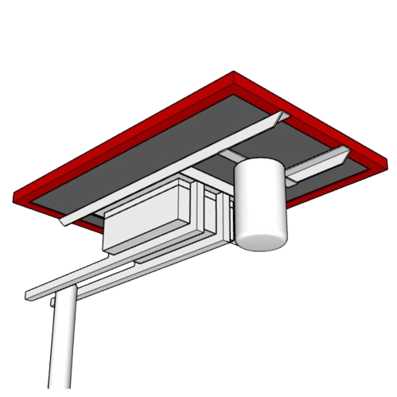

The physical design of the Solar-Powered Flood Alert System was developed to provide a durable, weather-resistant, and easily maintainable enclosure suitable for outdoor flood monitoring applications. The 3D model illustrates the overall mechanical arrangement of the solar panel mounting structure, sensor assembly, electronics enclosure, and external alarm components.

The supporting frame is fabricated using **mild steel angle bars** to provide sufficient mechanical strength while maintaining a lightweight structure suitable for field deployment. Mild steel was selected because of its availability, affordability, and ease of fabrication through cutting, drilling, and welding. To protect the steel structure from corrosion caused by rain, humidity, and outdoor exposure, the frame is coated with an **epoxy primer followed by two coats of acrylic topcoat**. The epoxy primer provides a strong anti-corrosion base layer, while the acrylic topcoat provides additional protection against moisture, UV exposure, and environmental wear.

The mounting system uses a **swivel clamp assembly designed for a 1 1/2-inch GI pipe post**. This design allows the entire monitoring station to be installed on a standard galvanized pipe support while providing flexibility for height adjustment and alignment during installation. The adjustable clamp simplifies deployment because the sensor height can be modified depending on the expected flood monitoring location, riverbank elevation, or drainage structure depth without requiring fabrication changes to the main frame.

The solar panel is positioned at the upper section of the structure to maximize exposure to sunlight and improve energy harvesting efficiency. The electronics enclosure is mounted directly below the solar panel to provide additional environmental protection. This arrangement creates a natural overhead shield that reduces direct exposure of the enclosure to rainfall and water splash while still allowing airflow around the electronics housing.

The main electronic components are housed inside a **waterproof ABS enclosure** to protect the ESP32 controller, SIM A7670E LTE module, relay module, buck converter, and power distribution circuitry from rain, dust, and accidental water exposure. ABS material was selected because it is lightweight, electrically insulating, corrosion-resistant, and suitable for outdoor electronic installations.

Cable entry and exit points are sealed using **waterproof cable glands**. These glands provide strain relief for external wiring while maintaining the water-resistant rating of the enclosure. Separate cable routes are provided for the siren and strobe light connections, preventing unnecessary stress on the internal circuit connections and improving long-term reliability.

For solar system maintenance, the design incorporates **panel-mount MC4 connectors** and **panel-mount fuse holders** installed on the exterior side of the enclosure. The panel-mount MC4 connectors allow the solar panel connection to be disconnected easily without opening the enclosure, simplifying troubleshooting and replacement. The external fuse holder provides quick fuse replacement access while keeping the protection device accessible during field maintenance.

The overall mechanical arrangement follows a modular design approach where each major component can be independently installed, adjusted, or replaced. The elevated solar panel structure protects sensitive electronics from floodwater exposure, while the adjustable GI pipe mounting system allows the system to be deployed in different locations with varying terrain conditions.

The combination of a corrosion-protected steel frame, adjustable mounting mechanism, waterproof enclosure, sealed cable management, and accessible solar connection points results in a robust physical design capable of supporting continuous operation in harsh outdoor flood monitoring environments.

You may also add a short **3D Drawing Description** below the figure:

**Figure X. 3D Model of the Solar-Powered Flood Alert System Assembly**

*The 3D drawing presents the complete mechanical arrangement of the flood alert station, including the solar panel support frame, adjustable GI pipe mounting clamp, waterproof electronics enclosure, external alarm wiring, and service access points. The design prioritizes durability, weather protection, and ease of installation for remote flood-prone locations.*

---

## SMS Commands Supported by the System

| SMS Command                           | Description                                                                                                              |
| ------------------------------------- | ------------------------------------------------------------------------------------------------------------------------ |
| `[SECURITY_CODE,SETUP_HELP,HELP]`            | Sends the complete list of supported SMS commands and usage instructions.                                                |
| `[SECURITY_CODE,SETUP_SENSOR,ZERO]`          | Captures the current ultrasonic sensor distance and stores it as the flood reference (zero water level) in flash memory. |
| `[SECURITY_CODE,SETUP_NUMBER,+639XXXXXXXXX]` | Updates the flood alert recipient phone number stored in flash memory.                                                   |
| `[SECURITY_CODE,GET_SENSOR_DATA,DATA]`       | Returns the current sensor reading, calibrated zero distance, and calculated water level in centimeters and feet/inches. |

### Example SMS Response

```text
SOLAR FLOOD ALARM

ZERO LEVEL: 250.0 cm
DISTANCE: 180.0 cm

WATER LEVEL: 70.0 cm
(2ft 3in)
```

### SMS Alert Example

```text
SOLAR FLOOD ALARM

FLOOD LEVEL 2 ALERT

WATER LEVEL:
45.0 cm

PLEASE PREPARE FOR POSSIBLE FLOODING.
```

### SMS Danger Alert Example

```text
SOLAR FLOOD ALARM

FLOOD LEVEL 4 DANGER

WATER LEVEL:
130.0 cm

IMMEDIATE EVACUATION MAY BE REQUIRED.
```

## You can add this section after **AT Commands Used by the System** or before the SMS Command section

---

## FUNDAMENTAL PROGRAMMING PRINCIPLES USED

The firmware of the Solar-Powered Flood Alert System was developed using structured embedded programming principles to achieve reliability, maintainability, and efficient resource utilization. The program was developed using **Visual Studio Code with PlatformIO IDE**, which provides an organized development environment for ESP32-based applications through library management, build automation, debugging support, and modular project structure.

The implementation follows object-oriented programming concepts, modular design practices, memory management techniques, and non-blocking embedded programming approaches to ensure continuous operation of the flood monitoring system.

---

### Development Environment: Visual Studio Code and PlatformIO IDE

The firmware was developed using **Visual Studio Code integrated with PlatformIO IDE** instead of the traditional Arduino IDE environment. PlatformIO provides improved project organization by separating source files, libraries, and configuration files while allowing easier dependency management.

The use of PlatformIO provides the following advantages:

* Structured project directory organization.
* Improved library management.
* Automatic compilation and dependency resolution.
* Better code navigation and debugging features.
* Support for multiple embedded platforms and boards.
* Easier migration from prototype code into production-level firmware.

The ESP32 firmware was programmed using the Arduino framework inside PlatformIO, allowing access to Arduino libraries while maintaining a professional embedded development workflow.

---

### Object-Oriented Programming and Class Design

The system uses object-oriented programming principles to separate hardware functions into independent classes. Hardware modules such as the relay controller, ultrasonic sensor, and SIM A7670E communication module were implemented as reusable classes.

Example:

```cpp
Relay Alarm(ALARM_RELAY_PIN, ALARM_RELAY_NAME, true);

Sonar FloodSensor(SONAR_TRIG_PIN, SONAR_ECHO_PIN, 10);

Sim7670e Sim(115200);
```

Instead of controlling hardware directly inside the main program, each component has its own dedicated class responsible for initialization and operation.

This improves:

* Code readability.
* Hardware abstraction.
* Reusability of modules.
* Easier debugging and replacement of components.

For example, the main program does not need to know the internal relay switching logic. It only calls:

```cpp
Alarm.on();
Alarm.off();
```

---

### Class Constructor Implementation

Constructors were used to initialize hardware objects when they are created.

Example:

```cpp
Relay Alarm(ALARM_RELAY_PIN, ALARM_RELAY_NAME, true);
```

The constructor automatically stores required parameters such as:

* GPIO pin assignment.
* Device name.
* Relay active state.

This removes repetitive initialization code and ensures that every object starts with a valid configuration.

---

### Header-Only Class Implementation Using Inline Methods

The hardware classes were implemented using header (`.h`) files only without separate `.cpp` implementation files.

Example structure:

```
lib/
 ├── Relay/
 │    └── Relay.h
 ├── Sonar/
 │    └── Sonar.h
 └── Sim7670e/
      └── Sim7670e.h
```

Functions were implemented using inline methods inside the header file.

Example:

```cpp
inline void Relay::on()
{
    digitalWrite(pin, ON_STATE);
}
```

This approach was selected because the classes are small hardware abstraction modules with simple functions. Advantages include:

* Faster development during prototyping.
* Easy portability between projects.
* Reduced file management complexity.
* Possible compiler optimization through inline expansion.

---

### Enumeration (enum) for System States and Commands

Enumerations were used to represent fixed states instead of using numerical values.

Example:

```cpp
enum FloodState
{
    STATE_NORMAL,
    STATE_FLOOD_LEVEL_1,
    STATE_FLOOD_LEVEL_2,
    STATE_FLOOD_LEVEL_3,
    STATE_FLOOD_LEVEL_4
};
```

The flood classification system becomes easier to understand compared to using raw numbers.

Instead of:

```cpp
if(state == 4)
```

the program uses:

```cpp
if(state == STATE_FLOOD_LEVEL_4)
```

Advantages:

* Improves readability.
* Prevents invalid state usage.
* Simplifies program expansion.
* Makes debugging easier.

An additional enumeration is used for SMS commands:

```cpp
enum CommandType
{
    COMMAND_UNKNOWN,
    SETUP_SENSOR,
    SETUP_NUMBER,
    SETUP_HELP,
    GET_SENSOR_DATA
};
```

This allows SMS instructions to be converted into internal program actions.

---

### Structure (struct) for Data Organization

Structures were used to group related variables into a single data object.

Example:

```cpp
struct SmsCommand
{
    String securityCode;
    CommandType type;
    String content;
    String senderNumber;
};
```

Instead of passing multiple variables separately, the complete SMS command information is stored as one object.

Example:

```cpp
SmsCommand command = parseSmsCommand(content, sender);
```

Benefits:

* Cleaner function parameters.
* Improved data organization.
* Easier future expansion.

---

### Non-Volatile Memory (Flash/NVS) Data Storage

The system stores important configuration data in non-volatile memory so settings remain available after power loss.

Stored parameters include:

* Flood zero-level calibration distance.
* SMS alert recipient number.

Example:

```cpp
EEPROM.put(
FLASH_ZERO_DISTANCE_ADDR,
distance);
```

A magic value check is implemented:

```cpp
#define FLASH_MAGIC_VALUE 0x14826301
```

During startup, the program checks whether valid configuration data already exists.

If the memory is uninitialized:

* Factory default values are loaded.
* Default settings are written.

If valid:

* Previous configuration is restored.

This prevents accidental use of corrupted or empty memory data.

---

### Modularity and Hardware Abstraction

The firmware was divided into independent functional modules:

| Module         | Function                                |
| -------------- | --------------------------------------- |
| Relay Class    | Controls siren and strobe output        |
| Sonar Class    | Handles ultrasonic distance measurement |
| SIM7670E Class | LTE communication and SMS handling      |
| Main Program   | System logic and coordination           |

This modular approach allows individual hardware components to be replaced without rewriting the entire program.

For example, changing the ultrasonic sensor requires modifying only the Sonar module instead of the entire firmware.

---

### Early Exit Programming Technique

Early exit logic was used to reduce unnecessary processing and improve program efficiency.

Example:

```cpp
if(currentFloodState == STATE_NORMAL)
{
    Alarm.off();
    return;
}
```

The function immediately exits when no alarm condition exists.

Advantages:

* Reduces CPU processing.
* Improves code readability.
* Avoids unnecessary nested conditions.

---

### Non-Blocking Programming Using millis()

The system avoids using long delays (`delay()`) because the controller must continuously:

* Read water levels.
* Monitor SMS commands.
* Control alarms.
* Maintain communication with the LTE module.

Instead, timing operations use the `millis()` function.

Example:

```cpp
if(currentMillis - previousMillis >= interval)
{
    previousMillis = currentMillis;
    Alarm.on();
}
```

This allows multiple tasks to execute simultaneously without stopping the processor.

The non-blocking approach is essential for a flood monitoring device because missing sensor readings or communication events during a delay could affect system reliability.

---

### Data Types and Memory Efficiency

Appropriate data types were selected based on the required range and memory limitations of the ESP32.

Examples:

| Data Type       | Usage                                     |
| --------------- | ----------------------------------------- |
| `bool`          | Two-state conditions such as alarm status |
| `int`           | Integer values such as command indexes    |
| `float`         | Water distance measurements               |
| `unsigned long` | Millisecond timers from `millis()`        |
| `String`        | SMS messages and commands                 |
| `const char*`   | Fixed text messages stored efficiently    |

Example:

```cpp
unsigned long previousMillis;
float waterLevelCm;
```

Using correct data types reduces memory waste and improves reliability.

---

### Macro Constants for Configuration

The program uses macros to define fixed configuration values.

Example:

```cpp
#define LEVEL1_ALARM_DURATION 10000UL
#define SECURITY_CODE "SECURITY_CODE"
```

Macros were used for:

* Pin assignments.
* Timing values.
* Memory addresses.
* Security settings.
* Default configuration.

Advantages:

* Centralized configuration.
* Easier modification.
* Prevents repeated hard-coded values.

---

### String Parsing and Command Processing

The system uses string parsing techniques to process SMS commands received from the SIM A7670E module.

Example SMS format:

```
[SECURITY_CODE,SETUP_SENSOR,ZERO]
```

The parser separates:

1. Security code.
2. Command type.
3. Command content.

Using:

```cpp
indexOf()
substring()
replace()
trim()
```

the raw SMS message is converted into a structured command:

```cpp
SmsCommand command;
```

This allows remote configuration through SMS without requiring physical access to the device.

---

### Security Implementation

A basic command authentication system was implemented to prevent unauthorized configuration.

Every SMS command must contain the correct security code:

Example:

```
[SECURITY_CODE,SETUP_SENSOR,ZERO]
```

The program checks:

```cpp
hasSecureCommand(content)
```

Only authenticated commands are processed.

Security features include:

* Password-protected SMS commands.
* Sender number identification.
* Restricted configuration access.
* Validation before executing commands.

This prevents unauthorized users from changing calibration values or alert recipients.

---

### Formatted Debug Output Using printf()

The program uses formatted serial output for easier monitoring and troubleshooting.

Example:

```cpp
Serial.printf(
"ZERO DISTANCE SAVED: %.2f cm\n",
measuredDistanceCm);
```

Advantages:

* Displays formatted numerical data.
* Reduces multiple print statements.
* Simplifies debugging during development.

Overall, the firmware design applies embedded programming principles including object-oriented design, modular architecture, non-blocking execution, structured data handling, secure command parsing, and persistent memory management. These techniques improve the reliability, maintainability, and scalability of the Solar-Powered Flood Alert System for long-term autonomous operation.

---
